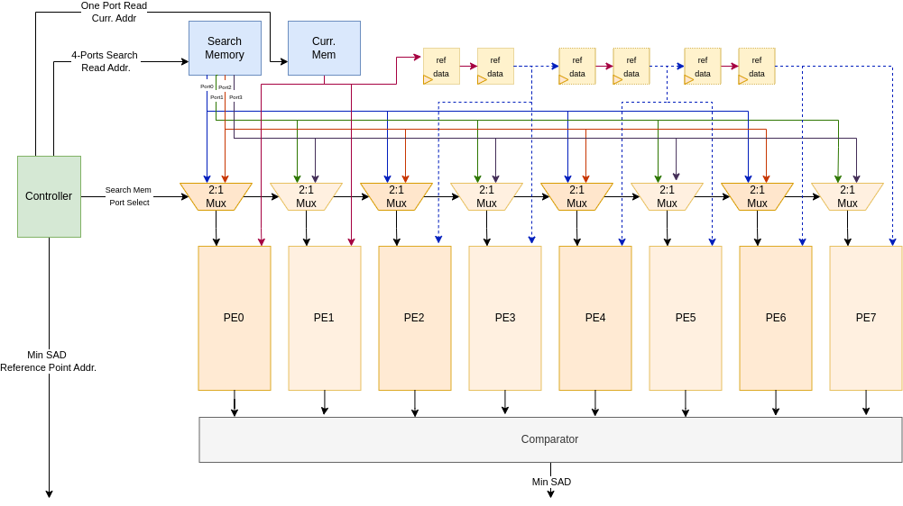
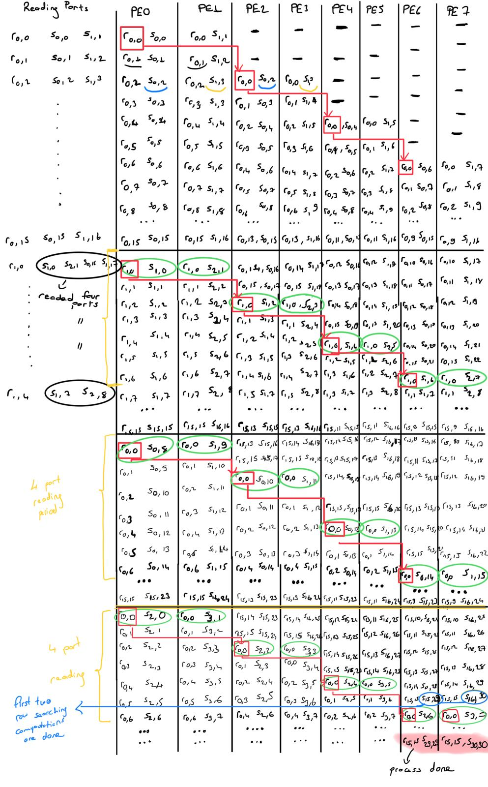

<table align="center"><tr><td align="center" width="9999">

# MAcelarator

Motion Estimation Accelerator
</td></tr></table>

### Accelerator Hardware

<table align="center"><tr><td align="center" width="9999">

Block Diagram of The Motion Estimation Accelerator
</td></tr></table>

### Scheduling

Tasarladığım accelerator tüm process elementlerini parallel çalıştırarak optimum sürede tüm SAD değerlerini hesaplamaya başlamaktadır. Bu scheduling'in accelerator'da nasıl çalıştığını detaylı anlamak için Apendix-A'daki tabloyu inceleyiniz.
Başlangıçta PE0 ilk search memory'deki satır ilk sütundan yani s(0,0)'dan (bellekte 0. adres) başlayarak işleme başlayarak ilk 16x16'lık resmin SAD değerini hesaplamaya başlamaktadır. Aynı anda PE1 s(1,2)'den (bellekteki 33. adres) başlayarak bir diğer kare için SAD değerini hesaplmaktadır. Bu iki processing elements aynı referance (current) memory'den okuduğu değeri kullanır.

<table align="center"><tr><td align="center" width="9999">

|Processing Element| Group |
|:----------------:|:-----:|
| PE0              | 0     |
| PE1              | 0     |
| PE2              | 1     |
| PE3              | 1     |
| PE4              | 2     |
| PE5              | 2     |
| PE6              | 3     |
| PE7              | 3     |

Table: Groups of Processing Elements
</td></tr></table>

Scheduling'in daha iyi anlaşılması için eş zamanlı işleme başlayan PE'leri yukarıdaki gibi grupladım. 

PE0-PE1 birinci grup elementleri işleme başladıktan iki clock periyodu sonrasında PE2 s(0,2)'den (bellekte 2. adres) işleme başlar. PE3 ise bir alt satırdan ve bir yandaki sütundan yani s(1,3)'den (bellekte 34. adres) işleme başlar. Bu iki processing element 2 clock periyodu öncesinde PE0 ve PE1'e giren referans mem. değerlerini kullanır. PE4, PE5'de iki clock periyodu sonrasında başlar ve iki clock cycle öncesindeki PE2-PE3'e giren referans mem. değerlerini kullanır. PE6 ve PE7'de (son PE grubu) aynı şekilde P4-P5 (2. PE grubu) işleme başlar ve ikinci grup elementlerinin iki clock cycle öncesinde kullanmış olduğu reference mem. değerlerini kullanır. Bu sayede reference memory için tek port yeterli olacaktır. Sekiz PE'lerin hepsi eş zamanlı olarak SAD değerlerini hesaplamaya devam edecektir.

<table align="center"><tr><td align="center" width="9999">

| Search Mem. Read Port | Set   |
|:---------------------:|:-----:|
| Port0                 | 0     |
| Port1                 | 0     |
| Port2                 | 1     |
| Port3                 | 1     |

Table: Sets of Search Memory Read Ports
</td></tr></table>

4 port kullanımını ve 2 port kullanımını daha iyi anlamak için search memory için read porlarını iki kümeye ayırdım. 4 port okuma durumunda 0. set ve 1. set'den okuma yapılırken, 2 port okuma durumunda ya 0. set'den portdan okuma yapılır ya da 1. set'den okuma yapılır.

PE0 ve PE1 kendi karelerinde ilk satır işlemini bitirdikten sonra search memory'nin diğer iki portundan okuma yapacaktır. Buraya kadar search memory'den sadece iki port (yani 0. set) kullanılmıştı. Fakat şimdi 4 port kullanma durumu ortaya çıktı. 0. grup PE'ler 1. set'den okuma yaparken diğer set'ler 0. portlardan okumaya devam edeceklerdir. Diğer PE'lerde ilk satır işlemini bitirene kadar bu 4 port okuma işlemi devam eder ve sonrasında tekrar iki port okuma durumu oluşur. Bu durumda sadece 1. set'den okunur. Gene PE'lerin satır işlemleri tamamlandığında 0 set aktif olur. Bu işlem bu şekilde devam eder.

PE elementleri işlemlerini tamamladığında aynı satırda bir sonraki karelerinde işlemlerine başlarlar. Bu duruma second process in same row (SPISR) durumu diyorum. PE0 ilk SPISR durumuna geçtiğinde s(0,8) (bellekte 8. adresten) (başlangıç adresi + process elements no'dan) işleme başlar. PE1 SPISR durumunda s(1,9) (bellekte 40. adresten) işleme başlar. Bir diğer örnek olarak SPISR durumunda olan PE5 ise s(1,13) (bellekte 43. adresten) işleme başlar. Daha deminki gibi tüm PE'ler kendi karelerinde SAD hesaplamalarını gerçekleştirirler. 

### Timing

Her bir SAD hesaplaması 256 clock cycle sürülmektedir.
Bir satırda execution'a başlayan paralel çalışan 4 PE vardır, onun altındaki satırda aynı zamanda execution'a başlayan 4 PE daha vardır.
Toplamda 8 PE paralel çalışmaktadır.

Scheduling'e göre tüm processlerin işleme başlama (loading) süresi 6 clock cycle sürecektir.

Bir satırdaki başlayan processlerin bitmesi toplamda  2 x 256 = 512 clock cycle sürecektir.
Aynı anda bir alt satırdan başlayan processlerde tamamlanacaktır.
Yani iki satırdaki processlerin tamamının bitmesi bitmesi yaklaşık 512 clock cyle periyodu sürmektedir (system load süresi dışında). 
Toplamda 31x31'lik bir resim için 16 satır başlangıç satırı olacaktır. Her iki satır paralel olarak hesaplanmaktadır.

Bu yüzden toplam process süresi 512 * (16 / 2) + 6 = 4013 clock cycle olacaktır.

#### Appendix-A

<table align="center"><tr><td align="center" width="9999">

Table: Scheduling of The Motion Estimation Accelerator
</td></tr></table>

---

Ömer Karslıoğlu
omerkarsliogluu@gmail.com