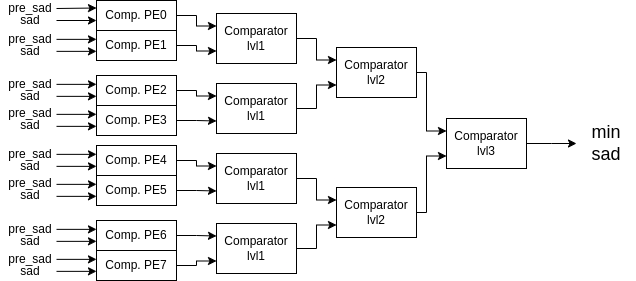

<table align="center"><tr><td align="center" width="9999">


# MAcelarator

High Performance Motion Estimation Accelerator Hardware
</td></tr></table>

It is a circuit that searches for a 16 x 16 image by completing SAD calculations in the optimal time on a 31 x 31 image.

A total of 128 SAD calculations are made in a search. There are 8 processing elements in total for SAD calculation. These PEs work in parallel as explained in the **Scheduling** section.

Each processing element starts from a column. For example, PE0 (processing element-0) starts processing from the 0th and 8th columns. PE1 starts processing from the 1st and 9th columns. PE1, PE3, PE5, PE7 cannot start from the row where PE0, PE2, PE3 and PE4 start processing. In this way, there is no need to search in some blocks. Instead of 256 SAD calculations in total, 128 SADs are calculated. This system is like using only the white squares on a chessboard.

The total processing time is equal to 4102 clock periods.

### 1. Motion Estimation

<table align="center"><tr><td align="center" width="9999">


Figure-1: Forumula of Block Matching Algorithm For Motion Estimation
</td></tr></table>

This design is designed with reference to the above formula. You can also look at [here](https://en.wikipedia.org/wiki/Block-matching_algorithm) to get more information about motion estimation algorithm.

### 2. Accelerator Hardware

<table align="center"><tr><td align="center" width="9999">


Figure-2: Block Diagram of The Motion Estimation Accelerator
</td></tr></table>

This accelerator has a total of 8 processing elements that calculate SAD. Search memory has 4 read ports, reference (current) memory has 1 read port. Both memories have 1 write port.

When the accelerator process starts, it does not always read from the search memory with 4 ports, it uses 2 ports most of the time, 4 port readings are done at the same time in approximately 37.5% of all processes. I recommend you to examine the **Scheduling** section and the **Appendix-A** section to understand this situation. Which of these ports will be used is selected with muxes as shown in the block diagram.

The control unit handles all scheduling operations and determining memory reading addresses.

I recommend you to examine **Figure-3** to understand how images/matrices are allocated in memory.

### 3. Scheduling

The accelerator I designed starts calculating all SAD values ​​in optimum time by running all process elements in parallel. To understand in detail how this scheduling works in the accelerator, please examine the table in **Appendix-A**.

The starting addresses of the processing elements for each SAD calculation process are given schematically in Figure-3.

At the beginning, PE0 starts calculating the SAD value of the first 16x16 image by starting the process from the first column of the first search memory, namely s(0,0) (the 0th address in the memory). At the same time, PE1 calculates the SAD value for another frame starting from s(1,1) (the 32rd address in the memory). These two processing elements use the same value they read from the reference (current) memory while reading and using different data from the search block.

<table align="center"><tr><td align="center" width="9999">

|Processing Element| Group |
|:----------------:|:-----:|
| PE0              | 0     |
| PE1              | 0     |
| PE2              | 1     |
| PE3              | 1     |
| PE4              | 2     |
| PE5              | 2     |
| PE6              | 3     |
| PE7              | 3     |

Table: Groups of Processing Elements
</td></tr></table>

For a better understanding of scheduling, I have grouped the PEs that start simultaneous processing as above.

PE0-PE1 first group elements start processing, PE2 starts processing from s(0,2) (2nd address in memory) two clock periods later. PE3 starts processing from the row below and the column next to it, i.e. s(1,3) (34th address in memory). These two processing elements use the reference mem. values ​​that entered PE0 and PE1 2 clock cycles ago.

PE4, PE5 start after two clock cycles and use the reference mem. values ​​that entered PE2-PE3 two clock cycles ago.

PE6 and PE7 (last PE group) start processing in the same way from P4-P5 (2nd PE group) and use the reference memory values ​​that the second group elements used two clock cycles ago. In this way, a single port will be sufficient for reference memory. All eight PEs will continue to calculate SAD values ​​simultaneously.

<table align="center"><tr><td align="center" width="9999">

| Search Mem. Read Port | Set   |
|:---------------------:|:-----:|
| Port0                 | 0     |
| Port1                 | 0     |
| Port2                 | 1     |
| Port3                 | 1     |

Table: Sets of The Search Memory Read Ports
</td></tr></table>

To better understand the usage of 4 ports and usage of 2 ports, I divided the read ports for search memory into two sets. In the case of reading 4 ports, reading is done from set-0 and set-1, while in the case of reading 2 ports, either reading is done from set-0 or reading is done from set-1.

After PE0 and PE1 complete the first row operation in their own frames, they will read from the other two ports of the search memory. Up until now, only two ports (i.e. set-0) were used from the search memory. But now, a situation of using 4 ports has emerged. While the PEs in group 0 are reading from set-1, the other sets will continue to read from port 0. This 4-port reading process continues until the other PEs complete the row operation, and then a two-port reading situation occurs again. In this case, the data from the search memory is read only from set-1. Again, when the row operations of the PEs are completed, set-0 becomes active. This process continues in this way.

When PEs complete their first process for a row, they start their second process for the same row in their second frame. Let's call this the second process in same row (SPISR) state.

When PE0 enters the first SPISR state, it starts processing at s(0,8) (from address 8 in memory) (starting address + # of process elements). PE1 starts processing at s(1,9) (from address 40 in memory) in the SPISR state. As another example, PE5, which is in the SPISR state, starts processing at s(1,13) (from address 43 in memory).

As mentioned before, all PEs complete their processes by performing SAD calculations in their own frames.

<table align="center"><tr><td align="center" width="9999">


Figure-3: The Start Addresses of Processing Elements
</td></tr></table>

The final memory address of a 31 x 31 image is 960. When this data is read from the search memory, the calculation of all SADs is completed.

### 4. Comparator

<table align="center"><tr><td align="center" width="9999">



Figure-3: Comparator Block Diagram
</td></tr></table>

The calculation of minimum SAD is calculated by comparing the comparator system in the control unit.

Each PE calculates SAD for a frame. There is also a comparator for each PE.

After a PE performs SAD calculation, it stores this SAD value in the register. When the same PE calculates SAD again, the minimum value obtained by comparing with the previously stored SAD value is stored in the same register again.

The number of SADs in the PE number is stored in the registers. These SADs are the minimum SAD values ​​calculated in each PE.

When all SADs are calculated, the SAD values ​​as many as this number of PEs are compared in stages and the minimum value is calculated. This situation is explained in **Figure-3**.

### 5. Timing

Each SAD calculation takes 256 clock cycles.

There are 4 PEs working in parallel starting execution in a row, and 4 more PEs starting execution in the row below it. In total, 8 PEs are working in parallel.

According to scheduling, the loading/pipeline load time of all processes will take 6 clock cycles. It will take a total of 2 x 256 = 512 clock cycles for the processes that start in a row to finish. The processes that start in the row at the same time will also be completed. In other words, it takes approximately 512 clock cycles for all the processes in the two rows to finish (excluding the system load time).

In total, there will be 16 starting rows for a 31x31 image. Both rows are calculated in parallel.

Therefore, the total process time will be 512 * (16 / 2) + 6 = **4102** clock cycles.

### 6. Verification

The ``.txt`` file filled with the data I specified was loaded into two memories in the simulation environment.

Then we see that the addresses here are sent correctly at the right time and that scheduling works correctly.

<table align="center"><tr><td align="center" width="9999">


Waveform-1
</td></tr></table>

In **Waveform-1**, address starts started at the 3rd ns. After 16 clock periods, the second group read port of the searc memory became active.

<table align="center"><tr><td align="center" width="9999">


Waveform-2
</td></tr></table>

In **Waveform-2**, it is seen that the first SADs are calculated as a result of 256 clock periods. Then, PEs start their last process in a row by shifting to the right within the same row. After 256 + 6 clock periods, the minimum SAD is calculated among 8 PE elements.

<table align="center"><tr><td align="center" width="9999">


Waveform-3
</td></tr></table>

As seen in **Waveform-3**, when the PEs finish their operations in the first row, they move to the next row and readings are performed from the appropriate port.

<table align="center"><tr><td align="center" width="9999">


Waveform-4
</td></tr></table>

When all operations are completed, the minimum SAD value is given as output and it is verified that the operation has been completed in 4102 cycles in total (3 ns for reset/enable signals). As shown in **Waveform-4**, the result is correctly output with the finish_o signal.

### 7. Usage

Just update the paths of the images in rtl/pkg/acc_pkg.sv

```systemverilog
  localparam string RImgMemPath = "/image_path/name.txt"; // reference (current) image path
  localparam string SImgMemPath = "/image_path/name.txt"; // search image path
```

### 8. Future Works:
1. Search Image and Reference Image dimensions can be made parametric.
2. Number of processing elements can be made parametric.
3. Configuration register can be added, the number of processing elements that will work simultaneously can be determined with this register, start signal can be set from here.
4. BUS (AXI etc.) protocol interface can be added.
5. Accelerator data can be pulled from DDR memory.
6. ASIC synthesis can be done.


#### Appendix-A

<table align="center"><tr><td align="center" width="9999">


Table: Scheduling of The Motion Estimation Accelerator
</td></tr></table>


---

Ömer Karslıoğlu

omerkarsliogluu@gmail.com